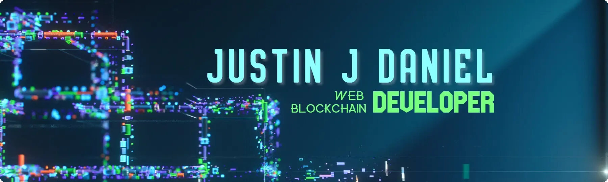

  
  

  <h2 align="left">
    Hi, folks!
    
    I'm Justin
</h2>

**Software Engineer** specializing in **Full-Stack Development, Cloud AI Engineering, & Distributed Systems**. Focused on architecting scalable web applications, integrating modern Generative AI workflows, and contributing to open-source software.

---

### 🚀 Current Engineering Focus

- 🤖 **AI Application Engineering:** Developing intelligent web applications powered by Google Cloud Vertex AI, Azure AI Studio, and Gemini models.
- 💻 **Full-Stack Development:** Building high-performance, accessible applications using Next.js, React, Node.js, and TypeScript.
- 🧱 **System Architecture:** Designing secure microservices, REST APIs, and distributed ledger (Web3) platforms.
- ✍️ **Technical Publishing:** Authoring technical articles on software architecture, full-stack patterns, and AI integration on my [personal website](https://justinjdaniel.com) and [Dev.to](https://dev.to/justinjdaniel).

---

### 🌱 Active Technical Mastery

- **Generative & Agentic AI:** Deepening expertise in prompt engineering, AI agent governance, and LLM-assisted workflows.
- **Cloud & Infrastructure:** Expanding cloud-native capabilities across GCP Vertex AI, AWS, and Azure.
- **Backend & Security:** Mastering high-throughput Go backend patterns, application security standards, and API optimization.

---

### 🎯 Key Goals & Aspirations

- 📦 Launch production-grade open-source applications integrating modern AI frameworks with Next.js.
- 📄 Author high-impact technical guides on full-stack system architecture and AI integration.
- 🤝 Collaborate with global engineering teams on open-source AI utilities and Web3 infrastructure.

---

<h3 align="center">📫 Connect & Collaborate</h3>

  
  
  

---

### 🛠️ Tech Stack & Capabilities

  
   
  
   
  <em>Engineered with Google Cloud Vertex AI, Azure AI, Next.js, React, Node.js, and Web3 Infrastructure.</em>

---

### 📈 GitHub Engineering Activity

<picture>
  <source media="(prefers-color-scheme: dark)" srcset="https://raw.githubusercontent.com/Justinjdaniel/JustinJDaniel/output/github-contribution-grid-snake-dark.svg">
  <source media="(prefers-color-scheme: light)" srcset="https://raw.githubusercontent.com/Justinjdaniel/JustinJDaniel/output/github-contribution-grid-snake.svg">
  
</picture>
